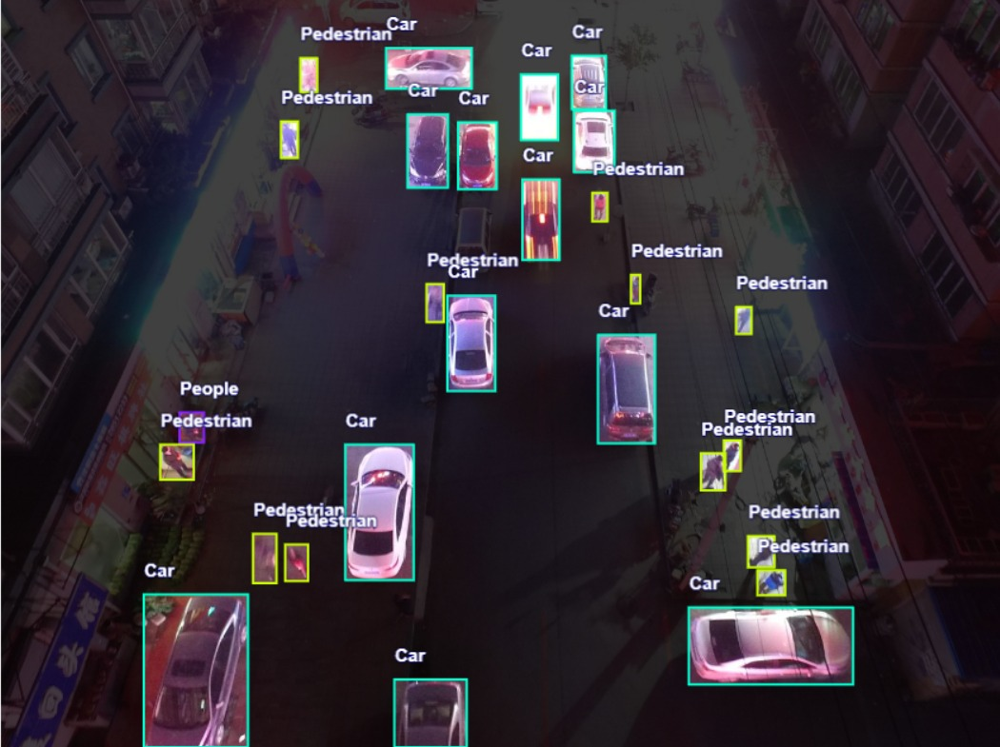
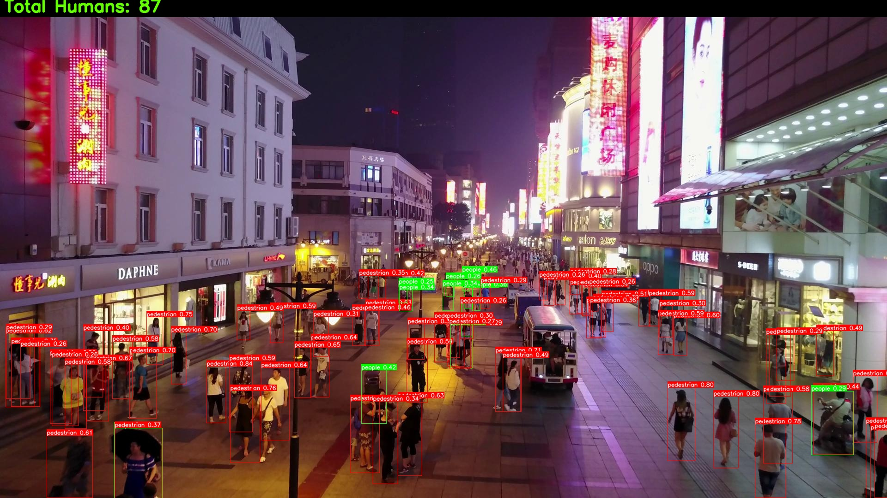
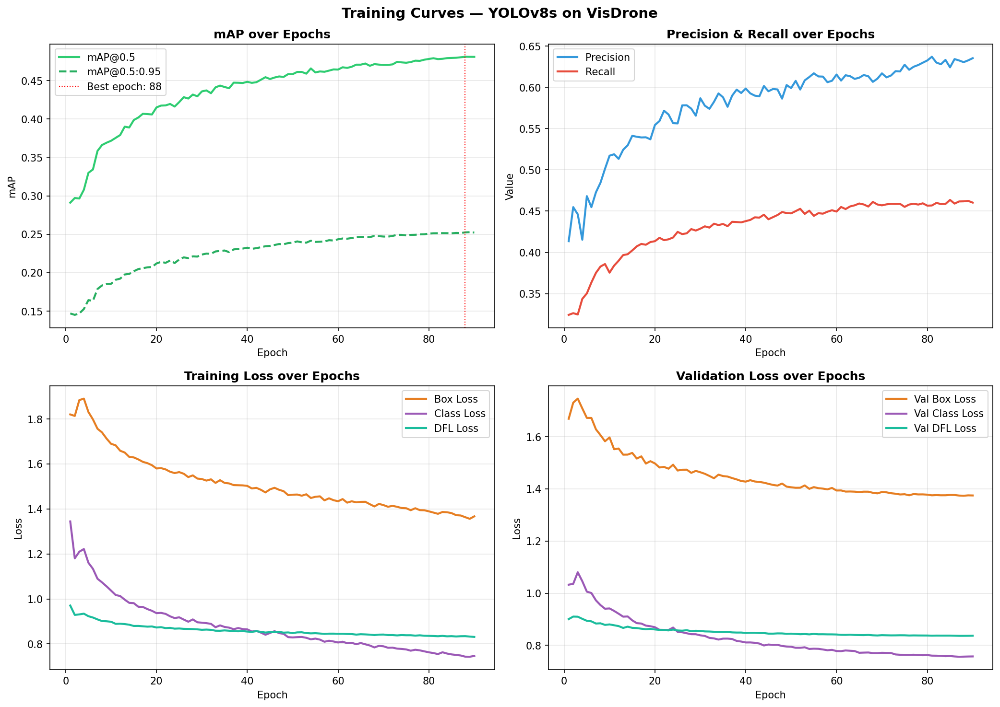
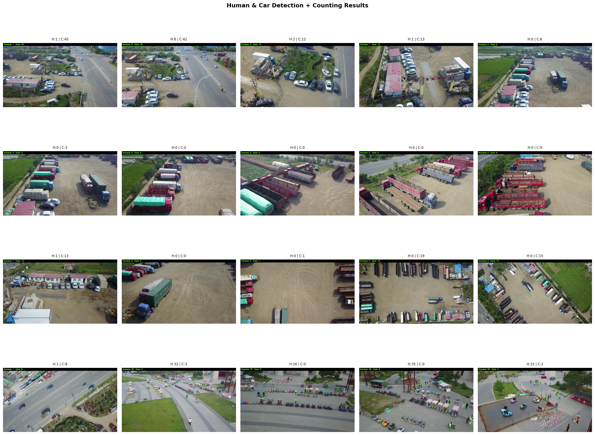

# Drone Human Detection & Counting System
### Antlings AI/ML Internship — Technical Assessment

---

## Table of Contents
- [Project Overview](#project-overview)
- [Dataset](#dataset)
- [Task-01: Dataset Understanding & Preprocessing](#task-01-dataset-understanding--preprocessing)
- [Task-02: Model Training](#task-02-model-training)
- [Task-03: Human & Car Detection with Counting](#task-03-human--car-detection-with-counting)
- [Task-05: Evaluation & Visualization](#task-05-evaluation--visualization)
- [Results Summary](#results-summary)

---

## Project Overview

A computer vision pipeline that analyzes drone/aerial images to:
- Detect humans (pedestrians & people) and cars
- Count total humans per image
- Visualize detection results with bounding boxes
- Track objects across frames using ByteTrack

**Model:** YOLOv8s fine-tuned on VisDrone  
**Hardware:** NVIDIA RTX 3050  
**Framework:** Ultralytics YOLOv8

---

## Dataset

**VisDrone2019** — Large-scale drone/aerial benchmark dataset

| Split | Images |
|-------|--------|
| Train | 6,471  |
| Val   | 548    |
| Test  | 1,610  |

**Classes used (filtered from original 10):**

| ID | Class      |
|----|------------|
| 0  | pedestrian |
| 1  | people     |
| 2  | car        |

Dataset link: [VisDrone on Kaggle](https://www.kaggle.com/datasets/banuprasadb/visdrone-dataset)

---


## Task-01: Dataset Understanding & Preprocessing

### Dataset Structure

The Kaggle version of VisDrone comes pre-converted to YOLO format by Ultralytics:

```
VisDrone_Dataset/
├── VisDrone2019-DET-train/
│   ├── images/      ← .jpg drone images
│   └── labels/      ← .txt YOLO format annotations
├── VisDrone2019-DET-val/
│   ├── images/
│   └── labels/
├── VisDrone2019-DET-test-dev/
│   ├── images/
│   └── labels/
└── visdrone.yaml
```

Each label file contains one line per object:
```
class_id  cx  cy  width  height
```
All values are normalized between 0 and 1 relative to image dimensions.

### Preprocessing with Roboflow

Dataset preprocessing and visualization was handled using **Roboflow**:

- Uploaded the VisDrone training split to Roboflow
- Filtered to 3 target classes: `pedestrian`, `people`, `car`
- Verified annotation quality through Roboflow's visual inspection tools

**Sample annotations visualized in Roboflow:**



### Key Challenges

**1. Extremely small objects**
Most humans occupy less than 0.1% of the total image area. At high drone altitude, a person can be as small as 8×8 pixels — making detection genuinely difficult.

**2. Heavy occlusion**
In dense crowd scenes, people significantly overlap each other. The model must detect partially visible humans, which reduces confidence scores.

**3. Class imbalance**
Pedestrians appear far more frequently than cars. This can cause the model to be biased toward detecting pedestrians.

**4. Scale variation**
Drone altitude varies across images. The same person can appear at very different scales depending on how high the drone is flying.

**5. Similar classes**
`pedestrian` (single person) and `people` (group) are visually similar and can be confused by the model.

### Augmentation

Augmentation is handled automatically by YOLOv8 during training. The following transforms are applied on every training batch:

| Augmentation | Value | Purpose |
|---|---|---|
| HSV Hue shift | 0.015 | Lighting variation |
| HSV Saturation | 0.7 | Color variation |
| HSV Brightness | 0.4 | Time of day simulation |
| Horizontal flip | 0.5 | Direction invariance |
| Mosaic | 0.5 | Multi-scale object learning |
| Shear | 2.0 | Handling unusual viewpoints |

---

## Task-02: Model Training

### Approach

Transfer learning from COCO pretrained YOLOv8s weights, fine-tuned on the filtered VisDrone dataset.

### Training Configuration

| Parameter | Value |
|-----------|-------|
| Model | YOLOv8s |
| Epochs | 90 (early stop) |
| Batch size | 4 |
| Image size | 512×512 |
| Optimizer | Auto (AdamW) |
| Patience | 15 |

### Training Code

```python
from ultralytics import YOLO

MODEL      = 'yolov8s.pt'
YAML_PATH = "VisDrone_Dataset/visdrone_filtered.yaml"
EPOCHS     = 100
BATCH      = 4
IMG_SIZE   = 512

model = YOLO(MODEL)

results = model.train(
    data      = YAML_PATH,
    epochs    = EPOCHS,
    imgsz     = IMG_SIZE,
    batch     = BATCH,
    device    = 0,
    project   = 'outputs',
    name      = 'train_filtered',
    patience  = 15,
    save      = True,
    plots     = True,
    hsv_h     = 0.015,
    hsv_s     = 0.7,
    hsv_v     = 0.4,
    flipud    = 0.0,
    fliplr    = 0.5,
    mosaic    = 0.5,
    shear     = 2.0
)
```

### Training Results

Training stopped at **epoch 90** with best performance at **epoch 88**.


Loss consistently decreased across all 90 epochs with no signs of overfitting, indicating the model learned effectively from the VisDrone data.

---

## Task-03: Human & Car Detection with Counting

### How It Works

1. Load trained `best.pt` weights
2. Run YOLOv8 inference on each test image
3. Filter detections by class (pedestrian=0, people=1, car=2)
4. Count all human detections (class 0 + class 1)
5. Draw bounding boxes with class labels and confidence scores
6. Display total human count as a banner on each image

### Counting Logic

```python
human_count = 0
for box in result.boxes:
    cls = int(box.cls[0].item())
    if cls in [0, 1]:       # pedestrian or people
        human_count += 1
```

Simple but effective — counts every valid detection above the confidence threshold.

### Color Coding

| Class | Color |
|-------|-------|
| Pedestrian | Red |
| People | Green |
| Car | Blue |

### Sample Detection Output



All processed images are saved to `outputs/task03/` with the human count displayed at the top of each image.

**Detection run stats:**
- Total test images processed: 1,610
- Confidence threshold: 0.25

---

## Task-05: Evaluation & Visualization

### Metrics

| Metric | Value |
|--------|-------|
| **mAP@0.5** | **48.21%** |
| mAP@0.5:0.95 | 25.37% |
| Precision | 63.35% |
| Recall | 46.26% |
| FPS (RTX 3050) | 22.64 |

### Per-class mAP@0.5

| Class | mAP@0.5 |
|-------|---------|
| pedestrian | 37.07% |
| people | 32.72% |
| car | 74.83% |

### Training Curves



### Confusion Matrix


### Validation Predictions


### Counting Visualization



### Strengths

- **Strong mAP@0.5** on a genuinely challenging aerial dataset
- **Stable training** — consistent loss reduction over 90 epochs with no overfitting
- **Transfer learning** — COCO pretrained weights gave strong initialization for person and car detection
- **Mosaic augmentation** — significantly helps with small object detection at varied scales

### Limitations

- **Tiny objects** — very small humans at high altitude still get missed
- **Heavy occlusion** — people in dense crowds are harder to detect individually
- **People vs pedestrian confusion** — visually similar classes cause misclassification
- **Fixed confidence threshold** — single threshold may not be optimal for all scenes

### Challenges Faced

- Class ID shift from original VisDrone (ignored class removed in Kaggle version)
- VRAM constraints on RTX 3050 required smaller batch size and image resolution
- Dense scenes with hundreds of overlapping people stress-test the NMS algorithm

---

## Results Summary

| Task | Status |
|------|--------|
| Dataset Understanding & Preprocessing | ✅ Complete |
| Model Training (YOLOv8s) | ✅ Complete |
| Human & Car Detection + Counting | ✅ Complete |
| Object Tracking (ByteTrack) | ❌ Incomplete |
| Evaluation & Visualization | ✅ Complete |

---

## Repository Structure

```
Antlings/
├── visdrone_filtered.yaml          ← dataset + project config
├── visdrone_filtered.example.yaml  ← template (safe to share)
├── task02_train.ipynb
├── task03_detect.ipynb
├── task04_track.ipynb
├── task05_evaluate.ipynb
├── outputs/
│   ├── task01/
│   ├── task03/
│   ├── task04/
│   └── task05/
└── README.md
```

---
